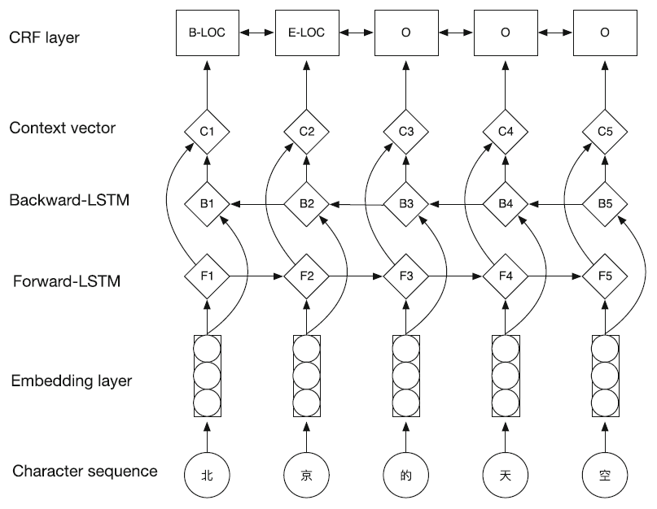

<p align="center"></p>

--------------------------------------------------------------------------------

# DomainNER

快速构建基于特定领域的中文命名实体识别系统

## 1 参考资料

**论文**
- [x] [(1) Bidirectional LSTM-CRF Models for Sequence Tagging](https://arxiv.org/pdf/1508.01991v1.pdf)
- [x] [(2) Character-Based LSTM-CRF with Radical-Level Features for Chinese Named Entity Recognition](https://link.springer.com/content/pdf/10.1007%2F978-3-319-50496-4_20.pdf)

**博客**
- [x] [(1) 达观数据如何打造一个中文NER系统](https://zhuanlan.zhihu.com/p/27597790)
- [x] [(2) How can I train my own NER model?](https://nlp.stanford.edu/software/crf-faq.html#a)

**代码**
- [x] [(1) zjy-ucas/ChineseNER](https://github.com/zjy-ucas/ChineseNER)
- [x] [(2) jiesutd/NCRFpp](https://github.com/jiesutd/NCRFpp)

## 2 模型

**Character-Based LSTM-CRF**

<p></p>

*图片来源：Character-Based LSTM-CRF with Radical-Level Features for Chinese Named Entity Recognition*

## 3 环境

```
pip3 install -r requirements.txt
```

## 4 运行

### 4.1 训练

```
$ python3 main.py --config train.config
```

### 4.2 使用

```
$ python3 main.py --config decode.config
```

## 5 实验

## 6 待续